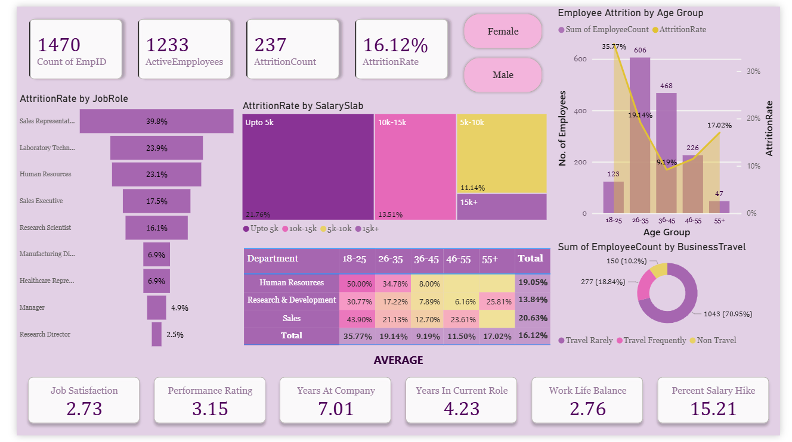

# Employee Attrition Dashboard

## Project Summary
This project analyzes HR data to understand **employee attrition patterns** — specifically:
- **Who is leaving**
- **Why they’re leaving**
- **Where attrition hurts the most**

The dashboard visualizes key metrics across job roles, salary slabs, age groups, and departments to help HR make informed decisions.

## Key Insights
- Overall attrition rate: **16.12%**
- Highest attrition by role: **Sales Reps (39.8%)**
- Highest attrition by salary slab: **< ₹5k (21.76%)**
- HR department has the highest attrition: **50%**
- Low job satisfaction (2.73) and work-life balance (2.76) may be contributing factors

## Tools & Skills Used
- Power BI  
- DAX (Calculated Fields)  
- Excel (for data preprocessing)  
- HR Analytics  
- Data Visualization  
- Dashboard Design  
- Business Problem Solving

## Dashboard Preview

## Files in This Repo
- [`hr_dashboard.pbix`](https://github.com/arushi813/employee-attrition-dashboard/blob/main/hr_dashboard.pbix) – Power BI file
- `EmployeeAttrition_Cleaned.xlsx` – Cleaned dataset in Excel (demonstrates Excel skills) 
- `dashboard.png` – Dashboard screenshot  
- `README.md` – This file

## Next Steps
If extended, future versions of this project could explore:
- Time-based attrition trends
- Predictive modeling for future attrition
- Exit reasons (if survey data is available)
  

## Let's Connect
Feel free to connect with me on [LinkedIn](www.linkedin.com/in/arushi-g-069176191) or check out more of my work!
